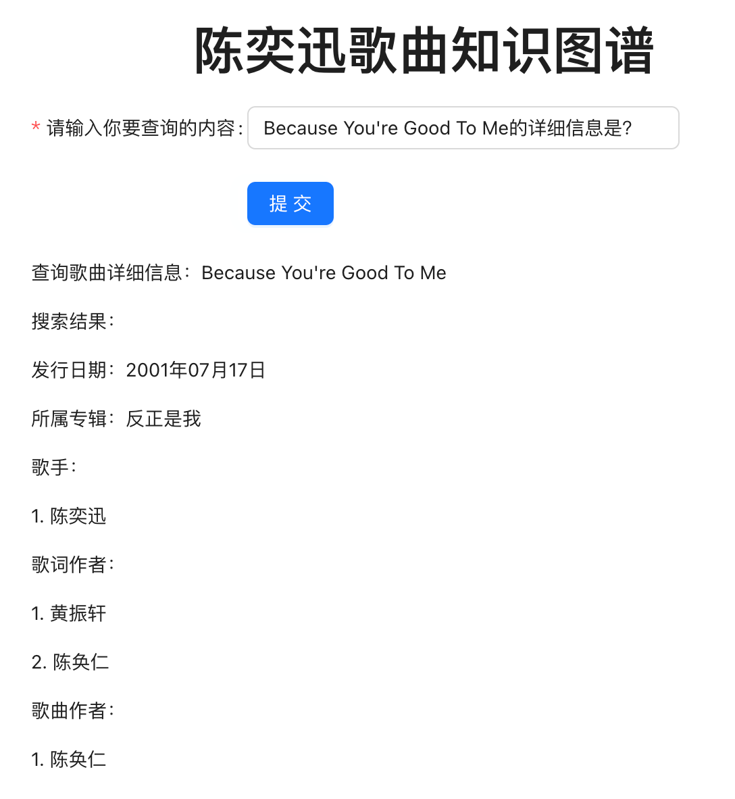
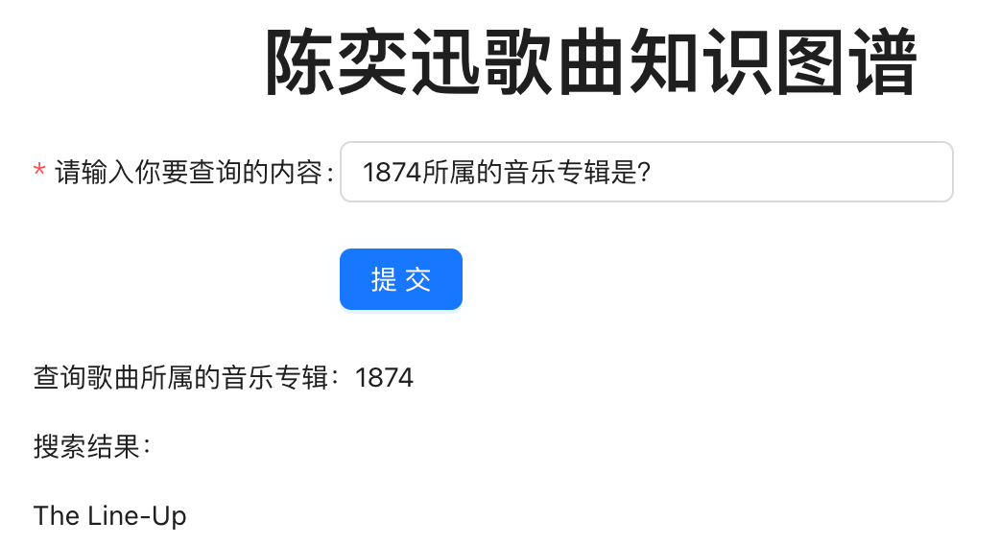
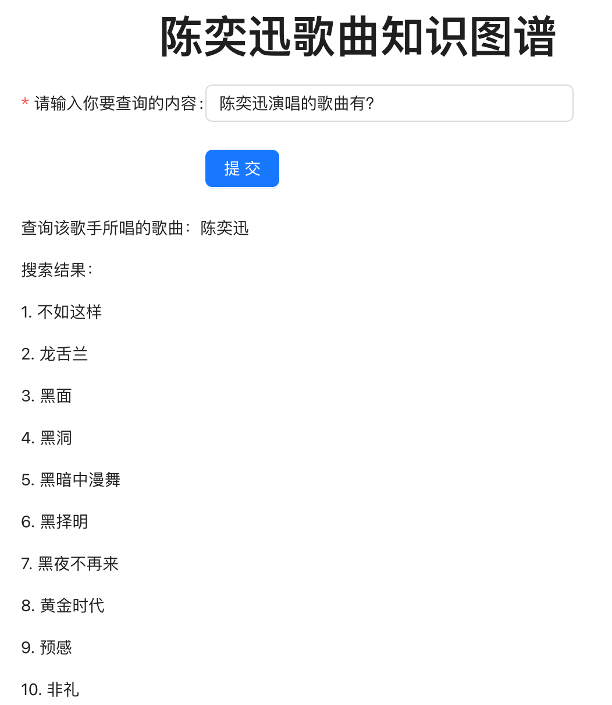

# 陈奕迅音乐作品知识图谱
## 知识图谱应用

[TOC]

### 前端

#### 前端框架

React

#### 相关依赖

安装node.js

#### 运行前端

```shell
# 进入相关目录
cd kg_application/frontend
# 配置环境(只有第一次运行前需要)
npm install
# 运行前端
npm start
```


### 后端

#### 后端框架

.NET core(C#)

#### 相关依赖

安装.NET 7.0 SDK

安装Visual Studio 或  Visual Studio Code及C#插件

#### 支持的问句

```python
###### 匹配：根据倒数的几位：“详细信息”、“音乐专辑”、“歌曲作者”、“歌词作者”、“歌手”
# 调用下其他的函数
Because You're Good To Me的详细信息是？
# match (a:`歌曲`{`名字`:"1874"})-[:`所属专辑`]->(b) return b.名字
1874所属的音乐专辑是？
# match (a:`歌曲`{`名字`:"1874"})-[:`作曲`]->(b) return b.名字
1874的歌曲作者是？
# match (a:`歌曲`{`名字`:"1874"})-[:`作词`]->(b) return b.名字
1874的歌词作者是？
# match (a:`歌曲`{`名字`:"1874"})-[:`歌手`]->(b) return b.名字
1874的歌手是？
###### 匹配：歌曲xxx
# match (a:`歌曲`{`名字`:"K歌之王"}) return a.发行日期
歌曲K歌之王的发行日期是？
###### 匹配：专辑xxx
# match (a:`歌曲`)-[:`所属专辑`]->(b:`音乐专辑`{`名字`:"婚礼的祝福"}) return a.名字
专辑婚礼的祝福包含的歌曲是？
###### 匹配：根据倒数的几位：“演唱”、“作曲”、“作词”
# match (a:`歌曲`)-[:`歌手`]-> (b:`歌手`{`名字`:"陈奕迅"}) return a.名字
陈奕迅演唱的歌曲有？
# match (a:`歌曲`)-[:`作曲`]->(b:`歌曲作者`{`名字`:"陈伟"}) return a.名字
陈伟作曲的歌曲有？
# match (a:`歌曲`)-[:`作词`]->(b:`歌词作者`{`名字`:"林夕"}) return a.名字
林夕作词的歌曲有？
```

#### 运行后端

```shell
# 进入相关目录
cd kg_application/frontend
# 运行后端
dotnet run
```

#### 后端接口地址

http://localhost:5158


### 结果展示

Because You're Good To Me的详细信息是？



1874所属的音乐专辑是？



1874的歌曲作者是？


1874的歌词作者是？


1874的歌手是？


歌曲K歌之王的发行日期是？


专辑婚礼的祝福包含的歌曲是？


陈奕迅演唱的歌曲有？



陈伟作曲的歌曲有？


林夕作词的歌曲有？


当不存在相关信息时：


