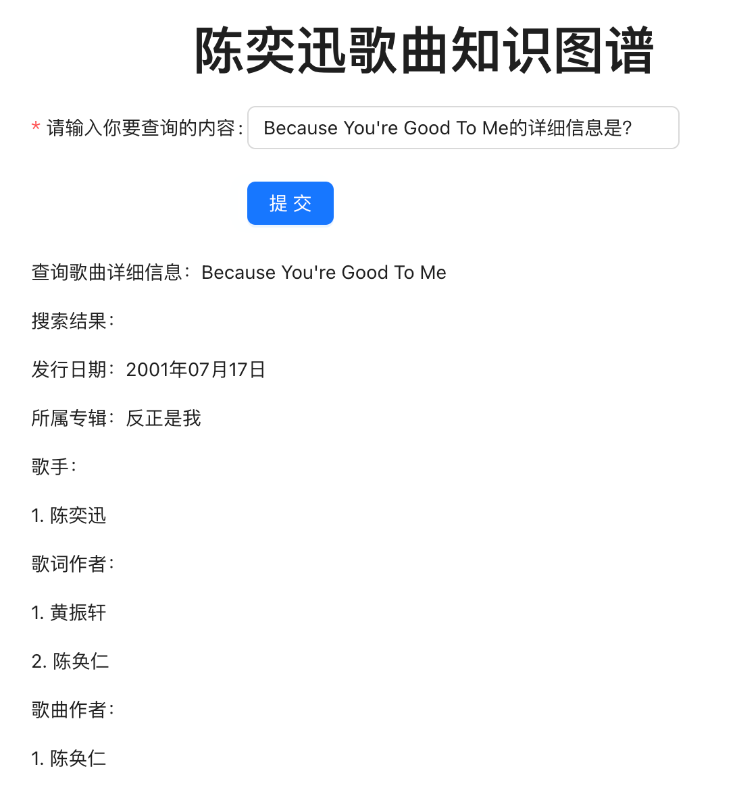
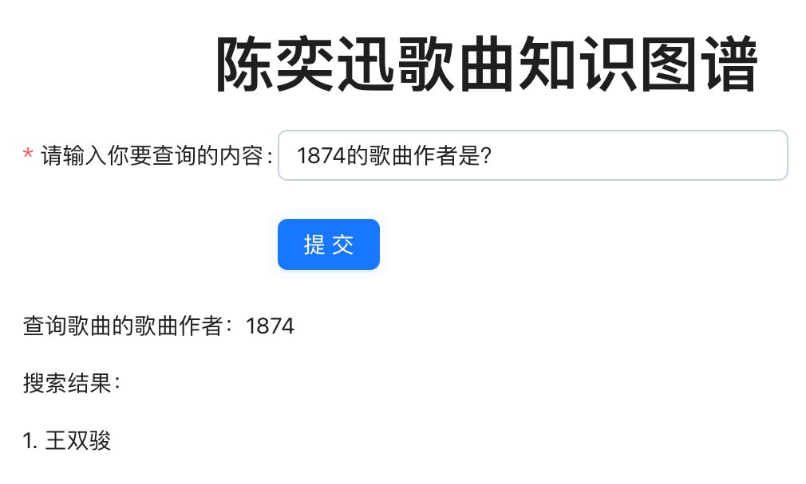
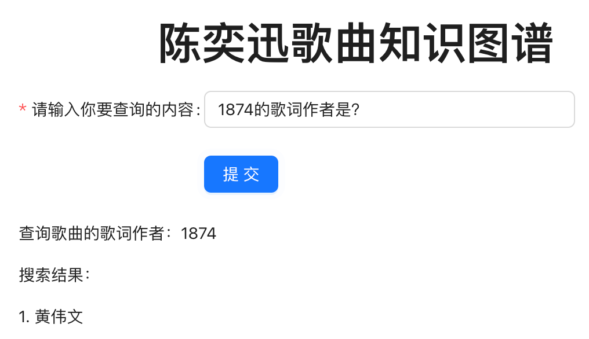
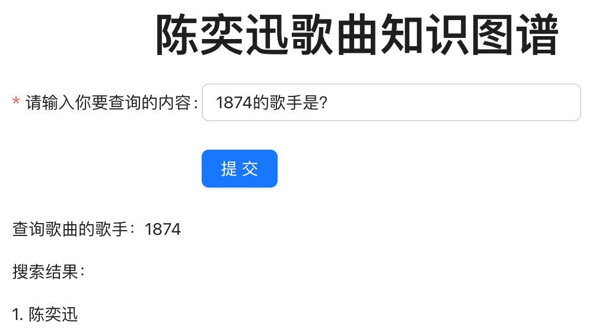
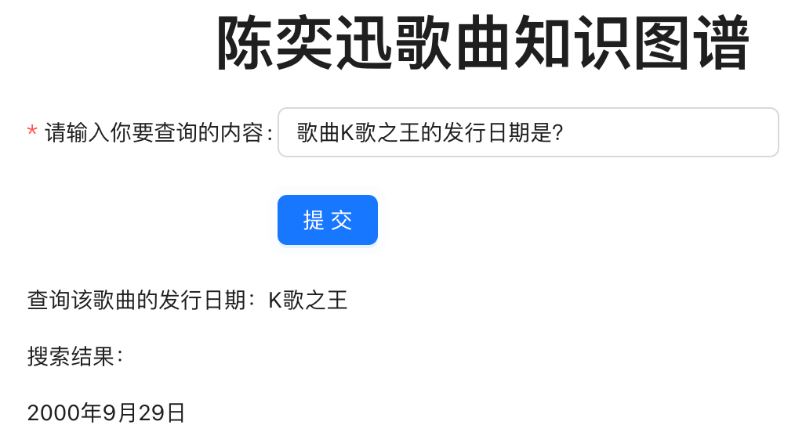
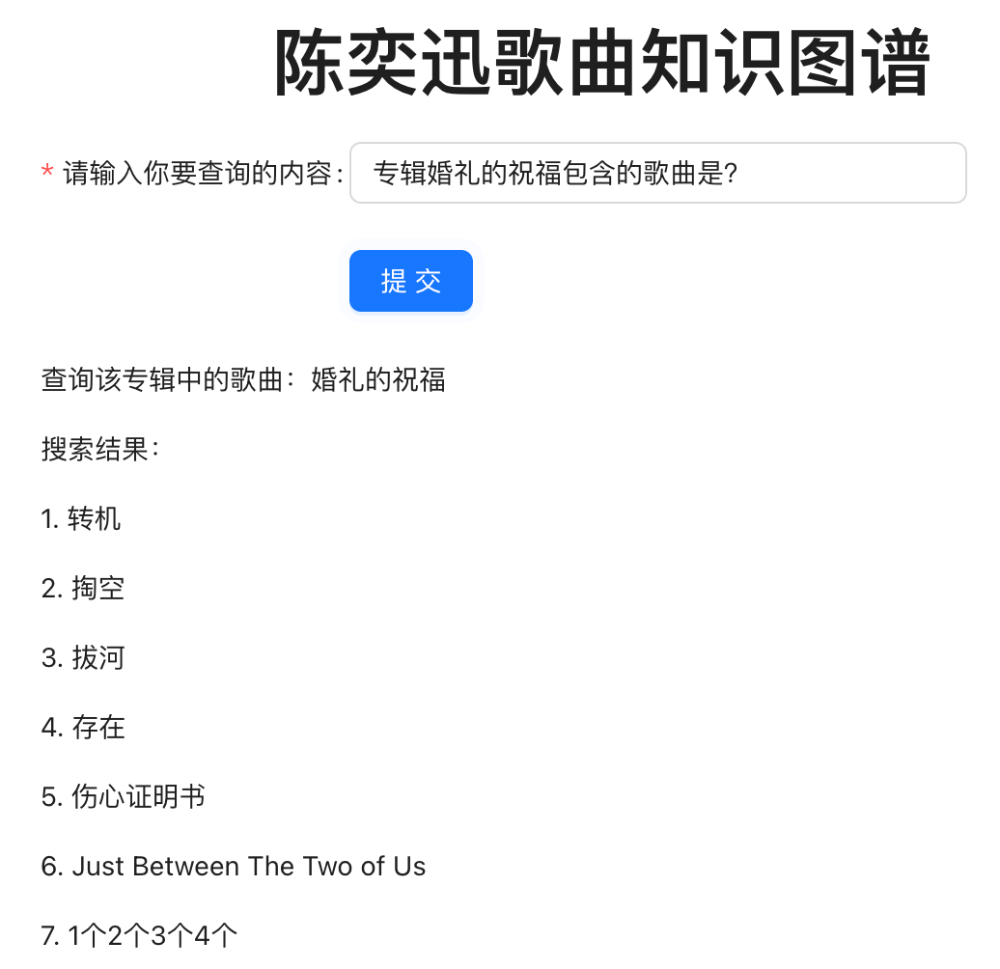
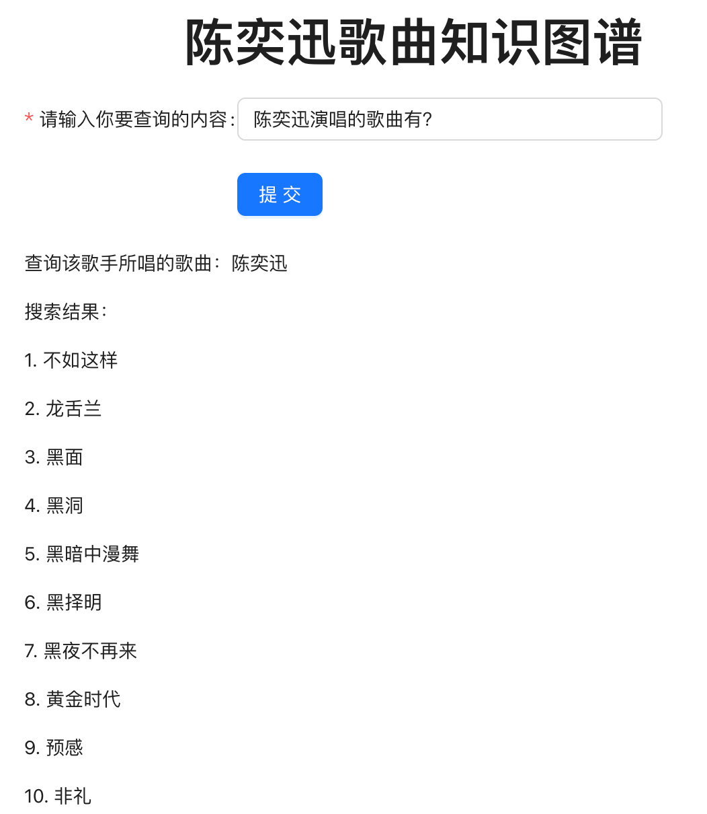
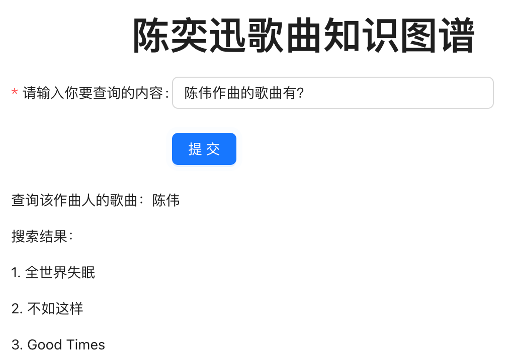
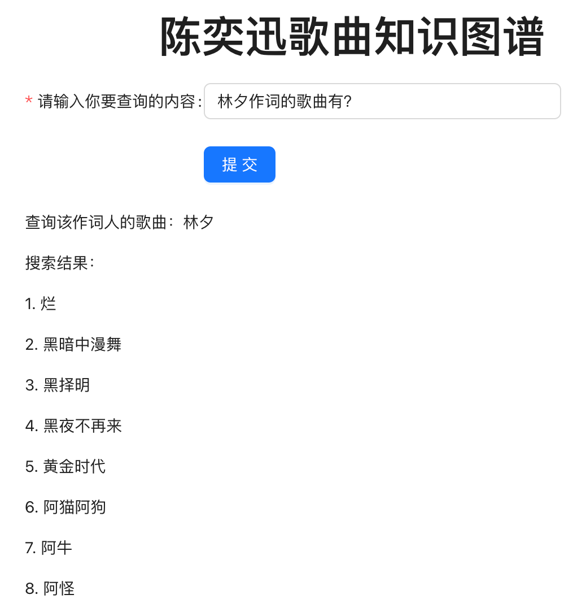
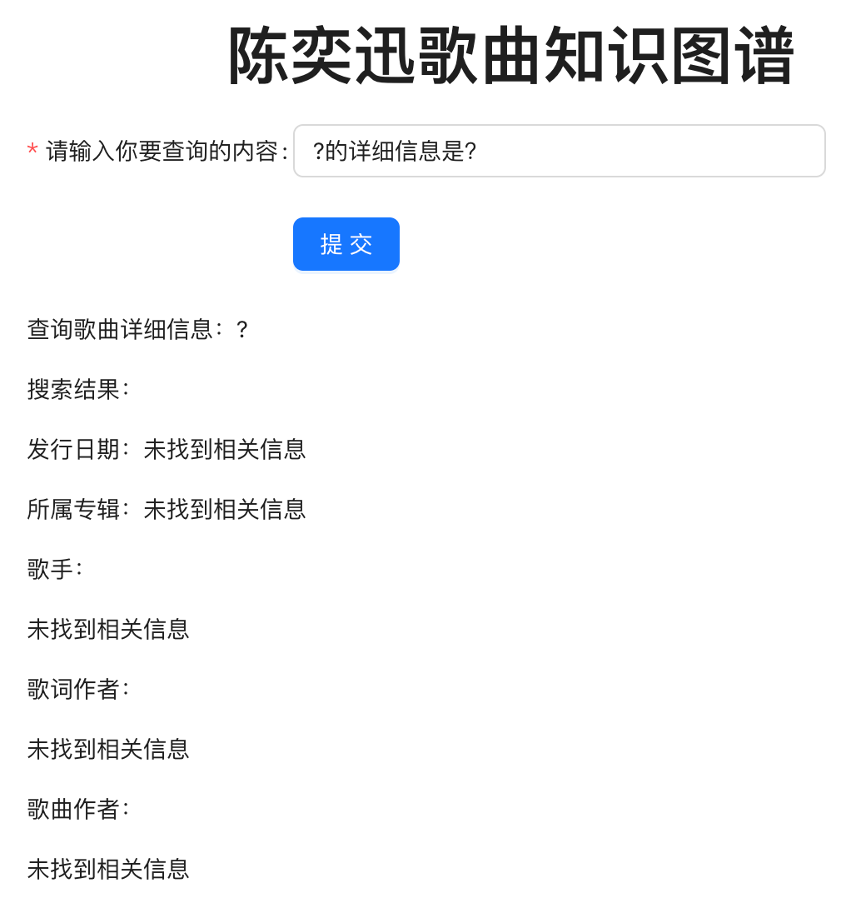

# 陈奕迅音乐作品知识图谱
## 项目介绍
2022年年末，陈奕迅的歌迷们终于盼来了在香港红馆举行的陈奕迅《FEAR AND DREAMS》演唱会，在此背景下，我们构建了陈奕迅音乐作品知识图谱，以便对陈奕迅演唱的作品进行更加深入的了解和分析。

<center>


图1：陈奕迅FearAndDreams演唱会海报（图源"陈奕迅FearAndDreams巡回演唱会"官方微博）
</center>

我们基于开放域数据（网易云音乐、百度百科）收集整理了陈奕迅演唱的歌曲及其相应介绍信息，并使用paddleNLP提供的信息抽取模型提取关系三元组（共计1,399条），此外还提取了歌曲的发行日期作为歌曲实体的属性（共计344条），使用csv格式存储。

<center>

图2：关系抽取示例
</center>

在此基础上，我们参照cnSchema定义的概念，使用neo4j完成了知识图谱的构建，其中实体包括"歌曲"、"音乐专辑"、"歌手"、"歌词作者"和"歌曲作者"，相应的关系包括"所属专辑"、"歌手"、"作词"和"作曲"，"歌曲"实体拥有"发行日期"属性。

<center>


图3：陈奕迅音乐作品知识图谱可视化结果
</center>

最后，我们基于构建的陈奕迅音乐作品知识图谱实现了简单的知识问答应用。支持的问句形式如下：

```python
###### 匹配：根据倒数的几位：“详细信息”、“音乐专辑”、“歌曲作者”、“歌词作者”、“歌手”
# 调用下其他的函数
Because You're Good To Me的详细信息是？
# match (a:`歌曲`{`名字`:"1874"})-[:`所属专辑`]->(b) return b.名字
1874所属的音乐专辑是？
# match (a:`歌曲`{`名字`:"1874"})-[:`作曲`]->(b) return b.名字
1874的歌曲作者是？
# match (a:`歌曲`{`名字`:"1874"})-[:`作词`]->(b) return b.名字
1874的歌词作者是？
# match (a:`歌曲`{`名字`:"1874"})-[:`歌手`]->(b) return b.名字
1874的歌手是？
###### 匹配：歌曲xxx
# match (a:`歌曲`{`名字`:"K歌之王"}) return a.发行日期
歌曲K歌之王的发行日期是？
###### 匹配：专辑xxx
# match (a:`歌曲`)-[:`所属专辑`]->(b:`音乐专辑`{`名字`:"婚礼的祝福"}) return a.名字
专辑婚礼的祝福包含的歌曲是？
###### 匹配：根据倒数的几位：“演唱”、“作曲”、“作词”
# match (a:`歌曲`)-[:`歌手`]-> (b:`歌手`{`名字`:"陈奕迅"}) return a.名字
陈奕迅演唱的歌曲有？
# match (a:`歌曲`)-[:`作曲`]->(b:`歌曲作者`{`名字`:"陈伟"}) return a.名字
陈伟作曲的歌曲有？
# match (a:`歌曲`)-[:`作词`]->(b:`歌词作者`{`名字`:"林夕"}) return a.名字
林夕作词的歌曲有？
```

以上问句的结果展示：

Because You're Good To Me的详细信息是？

<center>    
    </center>

1874所属的音乐专辑是？

<center>    
    </center>

1874的歌曲作者是？

<center>    
    </center>

1874的歌词作者是？

<center>    
    </center>

1874的歌手是？

<center>    
    </center>

歌曲K歌之王的发行日期是？

<center>    
    </center>

专辑婚礼的祝福包含的歌曲是？

<center>    
    </center>

陈奕迅演唱的歌曲有？

<center>    
    </center>

陈伟作曲的歌曲有？

<center>    
    </center>

林夕作词的歌曲有？

<center>    
    </center>

当不存在相关信息时：

<center>    
    </center>

## 文件夹介绍
- 数据爬取和抽取：`data_collection`
- 知识图谱构建：`kg_construction`
- 知识图谱应用：`kg_application`
- 构建图谱所用数据：`data_collection/data`